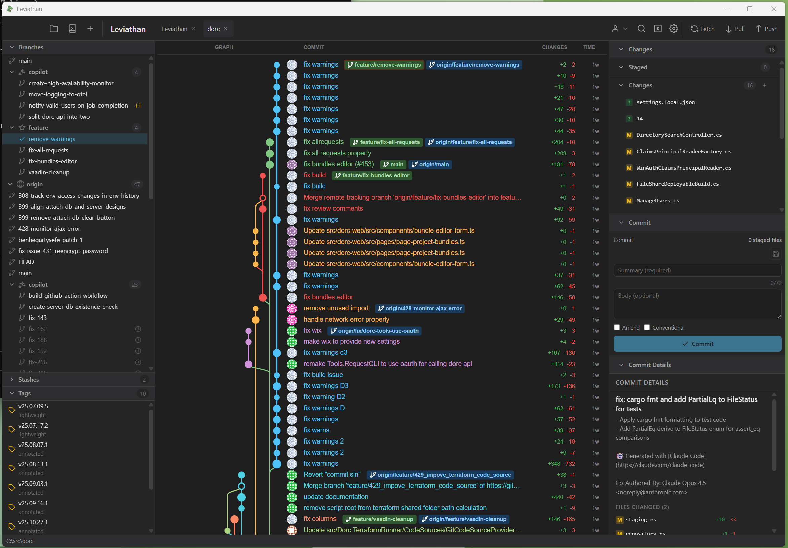
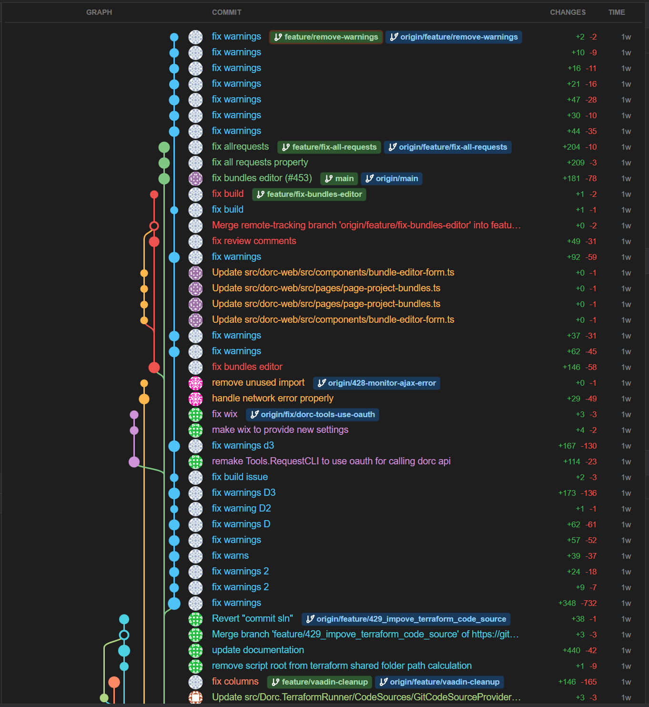
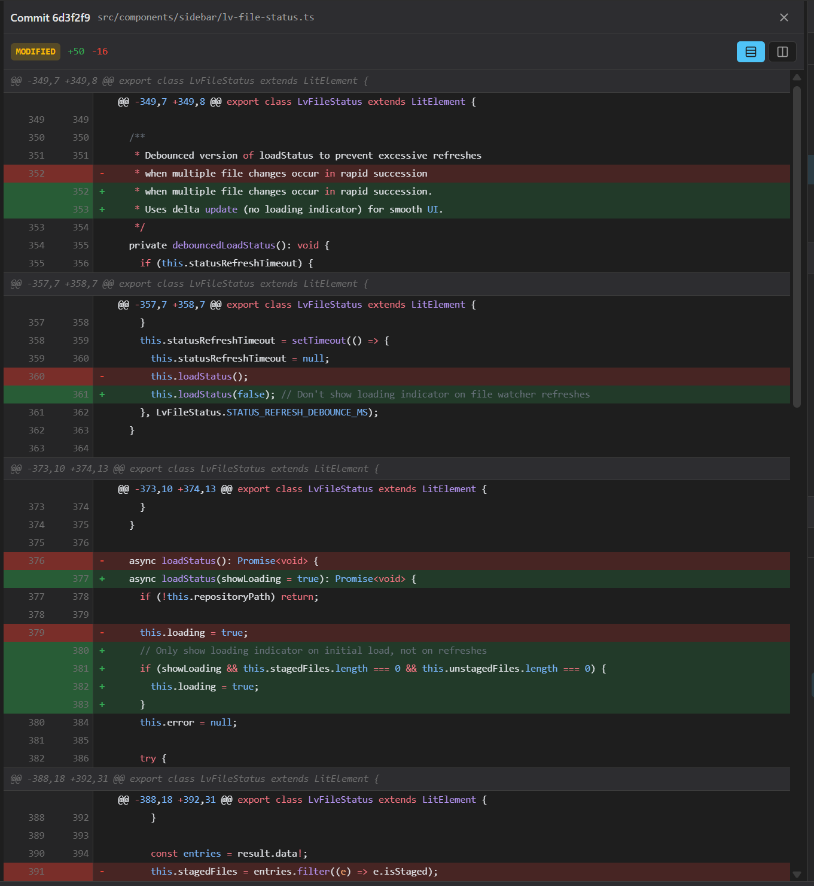

# Leviathan

[](https://github.com/hegsie/Leviathan/actions/workflows/build.yml)
[](https://github.com/hegsie/Leviathan/actions/workflows/ci.yml)
[](LICENSE)
[](https://github.com/hegsie/Leviathan/releases)
[](https://github.com/hegsie/Leviathan/releases)

A modern, cross-platform Git GUI client built with Tauri, Lit, and Rust.

Leviathan aims to be a fast, privacy-first alternative to existing Git clients like GitHub Desktop, GitKraken, and Sourcetree. It runs entirely offline with no telemetry, account requirements, or cloud dependencies.

## Table of Contents

- [Screenshots](#screenshots)
- [Why Leviathan?](#why-leviathan)
- [Features](#features)
- [System Requirements](#system-requirements)
- [Installation](#installation)
- [Quick Start](#quick-start)
- [Development](#development)
- [Tech Stack](#tech-stack)
- [Testing](#testing)
- [Roadmap](#roadmap)
- [Troubleshooting](#troubleshooting)
- [FAQ](#faq)
- [Contributing](#contributing)
- [Community & Support](#community--support)
- [License](#license)
- [Acknowledgments](#acknowledgments)

## Why Leviathan?

Leviathan is built for developers who value **privacy, performance, and control**:

- **🔒 Privacy-First**: No telemetry, no analytics, no cloud dependencies. Your code and workflow stay on your machine.
- **⚡ Performance**: Built with Rust and native Git libraries for blazing-fast operations, even with large repositories (100k+ commits).
- **🆓 Free & Open Source**: MIT licensed, no account required, no subscription fees, no feature paywalls.
- **🌐 Cross-Platform**: Native apps for macOS, Windows, and Linux with consistent UX.
- **🚫 Offline-First**: Works perfectly without an internet connection. Network operations only when you explicitly push/pull/fetch.
- **🤖 AI-Powered**: Local or cloud-based AI for commit message generation - choose from embedded local model (runs on your machine with GPU acceleration), Ollama, LM Studio, OpenAI, Anthropic, or GitHub Copilot.
- **🔧 Full-Featured**: Supports advanced Git operations like interactive rebase, cherry-pick, worktrees, submodules, and more.

### How is it Different?

| Feature | Leviathan | GitHub Desktop | GitKraken | Sourcetree |
|---------|-----------|----------------|-----------|------------|
| Privacy (no telemetry) | ✅ | ❌ | ❌ | ❌ |
| No account required | ✅ | ✅ | ❌ (free tier limit) | ❌ |
| Open source | ✅ | ✅ | ❌ | ❌ |
| Local AI features | ✅ | ❌ | ✅ (cloud only) | ❌ |
| Cloud AI providers | ✅ | ❌ | ✅ | ❌ |
| Interactive rebase UI | ✅ | ❌ | ✅ | ✅ |
| 3-way merge editor | ✅ | ❌ | ✅ | ✅ |
| GPG signing | ✅ | ✅ | ✅ | ✅ |
| Multiple integrations | ✅ (4+) | GitHub only | ✅ | ✅ |
| Worktrees | ✅ | ❌ | ❌ | ❌ |
| Git LFS | ✅ | ✅ | ✅ | ✅ |
| Image diff viewer | ✅ | ❌ | ❌ | ❌ |

## Screenshots

<p align="center">
  
</p>

<details>
<summary>More Screenshots</summary>

### Commit Graph


### Diff Viewer


</details>

## Features

### Repository Management
- Open, clone, and initialize repositories
- Multi-repository support with tabs
- File system watching for auto-refresh

### Commit Operations
- Commit history with interactive graph visualization and infinite scroll
- Create commits with staging support
- Hunk-level staging/unstaging
- Commit details view with file list
- Commit amend - modify last commit message and staged files

### Branch Operations
- Create, delete, rename branches
- Checkout branches and commits
- Branch tracking (upstream detection)
- Ahead/behind commit counting

### Merge & Rebase
- Merge with fast-forward, squash, and no-ff options
- Rebase onto branches
- Interactive rebase with action editor
- **3-Way Merge Conflict Editor** - Beyond Compare-style side-by-side conflict resolution
- Abort/continue operations

### Cherry-pick & Revert
- Cherry-pick specific commits to apply to current branch
- Conflict resolution support for cherry-pick
- Abort/continue cherry-pick operations
- Revert commits with auto-generated revert message
- Abort/continue revert operations

### Reset Operations
- Soft, mixed, and hard reset modes
- Reset to any commit with visual confirmation
- Context menu integration for quick access

### Remote Operations
- Fetch, pull, push
- Multiple remotes support
- Force push option

### Productivity Features
- **Command Palette** (Cmd/Ctrl+P) - fuzzy finder for actions, branches, files, and commits
- **File History** - view all commits that modified a file with rename following
- **Commit Search** - search by message, author, SHA, file path, or date range
- **Undo/Redo** - visual reflog browser for recovering previous states
- **Keyboard Shortcuts** - comprehensive keyboard navigation with vim-style support
- **Drag & Drop** - drag branches to merge/rebase, drag files to stage/unstage

### Tags & Stashes
- Tag management (create, delete, push)
- Stash management (create, apply, pop, drop)

### Diff & Blame
- Diff viewer with syntax highlighting (Shiki)
- **Image Diff Viewer** - compare images with 4 modes (side-by-side, onion-skin, swipe, difference)
- Blame view with author attribution
- Dark and light themes
- Syntax highlighting theme options

### Advanced Git Operations
- **Remote Management** - add, remove, rename remotes, edit URLs
- **Clean Operations** - remove untracked/ignored files with preview
- **Bisect** - binary search for bug-introducing commits
- **Submodules** - add, init, update, sync, remove submodules
- **Worktrees** - create, remove, lock/unlock, move multiple working directories
- **Git LFS** - track patterns, pull/fetch/prune large files

### Security & Configuration
- **GPG Signing** - configure keys, sign commits/tags, verify signatures, trust levels
- **SSH Key Management** - generate keys (Ed25519, RSA, ECDSA), view/copy public keys, test connections
- **Git Configuration** - view/edit global and repository config, manage aliases, user identity
- **Credential Management** - credential helper configuration, test credentials, per-remote settings

### GitHub Integration
- **Pull Requests** - view PRs, create PRs, PR status visualization in commit graph
- **Issues** - view issues, create issues, filter by state/labels
- **Commit Linking** - automatic issue reference detection (fixes #123, closes #456)
- **Releases** - view releases, create releases with auto-generated notes
- **GitHub Actions** - workflow run status, check runs for commits
- **OAuth Authentication** - secure authentication flow

### GitLab Integration
- **Merge Requests** - view MRs, create MRs, status filtering
- **Issues** - view issues, create issues, label filtering
- **Pipelines** - view CI/CD pipeline status
- **OAuth Authentication** - secure authentication flow

### Azure DevOps Integration
- **Pull Requests** - view PRs, create PRs, PR status filtering
- **Work Items** - browse and query work items by project
- **Pipelines** - view pipeline/build run status

### Bitbucket Integration
- **Pull Requests** - view PRs, create PRs, status filtering
- **Issues** - view issues with priority and status
- **Pipelines** - view pipeline run status

### AI-Powered Features
- **Commit Message Generation** - generate conventional commit messages from staged diffs
- **Multiple AI Providers** - supports local (Ollama, LM Studio) and cloud-based (OpenAI, Anthropic, GitHub Copilot) providers
- **Embedded LLM (Default)** - uses [Tavernari/git-commit-message](https://huggingface.co/Tavernari/git-commit-message) model (~2GB quantized)
- **Offline-First** - default embedded model and local providers work completely offline
- **GPU Acceleration** - Metal on macOS, CUDA on Windows/Linux for embedded model (configurable via `LEVIATHAN_GPU_LAYERS`)
- **Auto-Detection** - automatically discovers local LLM providers (Ollama, LM Studio)
- **Provider Configuration** - test and configure AI providers with API key support
- **Progress Feedback** - download progress and generation status in UI

### Unified Profiles
- **Multiple Identities** - configure work/personal Git identities
- **Integration Accounts** - link GitHub, GitLab, Azure DevOps accounts to profiles
- **Auto-Detection** - automatically switch profiles based on repository URL patterns
- **Profile Switching** - switch identity and linked accounts together

## System Requirements

### Minimum Requirements

- **Operating System**:
  - macOS 10.15 (Catalina) or later
  - Windows 10 (64-bit) or later
  - Linux (kernel 4.4+) with GTK 3.24+
  
- **Hardware**:
  - 4 GB RAM (8 GB recommended for large repositories)
  - 500 MB disk space (+~2 GB for AI model if using commit message generation)
  - Any x64 or ARM64 processor
  
- **Software**:
  - Git 2.20+ (automatically uses system Git installation)
  
### Recommended for AI Features

- **macOS**: Apple Silicon (M1/M2/M3) for Metal GPU acceleration
- **Windows**: NVIDIA GPU with CUDA support (GTX 1060 or better)
- **Linux**: NVIDIA GPU with CUDA support (GTX 1060 or better)

> **Note**: AI features work on CPU-only systems but will be slower. You can disable GPU acceleration if needed (see [Troubleshooting](#troubleshooting)).

## Installation

### Download

Pre-built binaries are available from the [Releases](https://github.com/hegsie/Leviathan/releases) page:

| Platform | Download |
|----------|----------|
| macOS (Universal) | `.dmg` |
| macOS (ARM64) | `.dmg` |
| Windows | `.msi` or `.exe` |
| Linux | `.deb` or `.AppImage` |

### Build from Source

#### Prerequisites

- [Node.js](https://nodejs.org/) 20+
- [Rust](https://rustup.rs/) 1.70+
- Platform-specific dependencies (see below)

#### macOS

```bash
xcode-select --install
```

#### Linux (Debian/Ubuntu)

```bash
sudo apt-get update
sudo apt-get install -y \
  libwebkit2gtk-4.1-dev \
  libayatana-appindicator3-dev \
  librsvg2-dev \
  libssl-dev \
  libgtk-3-dev \
  libglib2.0-dev \
  libdbus-1-dev
```

#### Windows

Install [Visual Studio Build Tools](https://visualstudio.microsoft.com/visual-cpp-build-tools/) with the "Desktop development with C++" workload.

#### Build Steps

```bash
# Clone the repository
git clone https://github.com/hegsie/Leviathan.git
cd Leviathan

# Install dependencies
npm install

# Build and run in development mode
npm run tauri:dev

# Build for production
npm run tauri:build
```

Production builds are output to `src-tauri/target/release/bundle/`.

## Quick Start

### First Time Setup

1. **Download and Install**: Get the latest release for your platform from the [Releases](https://github.com/hegsie/Leviathan/releases) page.

2. **Open a Repository**: 
   - Click **"Open Repository"** or press `Cmd/Ctrl+O`
   - Navigate to any existing Git repository on your machine
   - Or clone a repository using **"Clone Repository"**

3. **Explore the Interface**:
   - **Left Sidebar**: Navigate between branches, tags, remotes, and stashes
   - **Center Panel**: View commit history with interactive graph
   - **Right Sidebar**: See changes, stage files, and write commit messages
   - **Bottom Panel**: View diffs with syntax highlighting

### Common Workflows

#### Making a Commit

1. Make changes to files in your repository
2. Files appear in the **Changes** section of the right sidebar
3. Click on files to view diffs in the bottom panel
4. Click the **+** button next to files to stage them (or stage individual hunks)
5. Write a commit message in the text area
6. Click **"Commit"** or press `Cmd/Ctrl+Enter`

#### Creating a Branch

1. Right-click on any commit in the history
2. Select **"Create Branch"**
3. Enter a branch name
4. Click **"Create"** to create and checkout the new branch

#### Merging Branches

1. Checkout the target branch (e.g., `main`)
2. Right-click on the branch you want to merge
3. Select **"Merge into current branch"**
4. Choose merge options (fast-forward, squash, no-ff)
5. Click **"Merge"**

#### Using the Command Palette

Press `Cmd/Ctrl+P` to open the command palette and quickly access any feature with fuzzy search.

### Keyboard Shortcuts

| Action | macOS | Windows/Linux |
|--------|-------|---------------|
| Command Palette | `Cmd+P` | `Ctrl+P` |
| Open Repository | `Cmd+O` | `Ctrl+O` |
| Commit | `Cmd+Enter` | `Ctrl+Enter` |
| Refresh | `Cmd+R` | `Ctrl+R` |
| Stage/Unstage File | `Space` | `Space` |
| Search | `Cmd+F` | `Ctrl+F` |

> **Tip**: Press `?` anywhere in the app to see all available keyboard shortcuts.

## Development

### Available Scripts

| Command | Description |
|---------|-------------|
| `npm run dev` | Start Vite dev server |
| `npm run tauri:dev` | Run app in development mode |
| `npm run tauri:build` | Build production application |
| `npm run build` | Build frontend only |
| `npm run test` | Run tests |
| `npm run test:watch` | Run tests in watch mode |
| `npm run typecheck` | Type check without emitting |
| `npm run lint` | Lint TypeScript files |
| `npm run lint:fix` | Lint and fix issues |
| `npm run format` | Format code with Prettier |

### Project Structure

```
leviathan/
├── src/                    # Frontend (TypeScript/Lit)
│   ├── components/         # UI components
│   │   ├── common/         # Shared components
│   │   ├── dialogs/        # Modal dialogs
│   │   ├── graph/          # Commit graph visualization
│   │   ├── panels/         # Content panels (diff, blame)
│   │   ├── sidebar/        # Navigation sidebars
│   │   └── toolbar/        # Top toolbar
│   ├── services/           # API and service layer
│   ├── stores/             # Zustand state management
│   ├── types/              # TypeScript type definitions
│   └── styles/             # CSS and design tokens
│
├── src-tauri/              # Backend (Rust)
│   ├── src/
│   │   ├── commands/       # Tauri command handlers
│   │   ├── services/       # Business logic
│   │   └── models/         # Data structures
│   ├── Cargo.toml          # Rust dependencies
│   └── tauri.conf.json     # Tauri configuration
│
├── e2e/                    # End-to-end tests (Playwright)
│   └── tests/              # E2E test specs
├── plan/                   # Technical documentation
├── docs/                   # Additional documentation
└── .github/workflows/      # CI/CD pipelines
```

### Architecture

Leviathan uses a **multi-process architecture** powered by Tauri:

- **Frontend Process**: Web-based UI built with Lit web components, running in a WebView
- **Backend Process**: Rust application handling Git operations via libgit2 and system Git
- **IPC Communication**: Type-safe communication between frontend and backend using Tauri's command system

**Key Design Decisions**:

- **libgit2** for core Git operations (staging, commits, branches) for speed and portability
- **System Git** (via shell) for complex operations (rebase, submodules) to avoid libgit2 limitations
- **Zustand** for reactive state management on the frontend
- **SQLite** for caching repository metadata and indexing
- **AI Providers** (llama-cpp-2) for embedded local LLM, with support for external providers (Ollama, LM Studio, OpenAI, Anthropic, GitHub Copilot)

### Development Workflow

1. **Start Development Server**:
   ```bash
   npm run tauri:dev
   ```
   This starts both the Vite dev server (frontend) and the Rust/Tauri app (backend) with hot reload.

2. **Make Changes**:
   - Frontend changes (TypeScript/Lit) hot-reload automatically
   - Backend changes (Rust) trigger automatic recompilation and app restart

3. **Lint and Format**:
   ```bash
   npm run lint          # Lint TypeScript
   npm run format        # Format with Prettier
   cd src-tauri && cargo fmt  # Format Rust
   ```

4. **Type Check**:
   ```bash
   npm run typecheck     # Check TypeScript types
   cd src-tauri && cargo check  # Check Rust compilation
   ```

5. **Run Tests** (see [Testing](#testing) section below)

6. **Build for Production**:
   ```bash
   npm run tauri:build
   ```

### Contributing Guide

Before submitting a pull request:

1. Read the [Contributing](#contributing) section
2. Ensure all tests pass (`npm test`)
3. Run linters and formatters
4. Test on your target platform
5. Update documentation if adding new features

For detailed OAuth setup instructions (for integration features), see [docs/oauth-setup.md](docs/oauth-setup.md).

## Tech Stack

### Frontend
- [Lit](https://lit.dev/) - Web components framework
- [Vite](https://vitejs.dev/) - Build tool
- [Zustand](https://zustand-demo.pmnd.rs/) - State management
- [Shiki](https://shiki.style/) - Syntax highlighting
- [TypeScript](https://www.typescriptlang.org/) - Type safety

### Backend
- [Tauri 2.0](https://v2.tauri.app/) - Desktop application framework
- [Rust](https://www.rust-lang.org/) - Systems programming language
- [git2-rs](https://github.com/rust-lang/git2-rs) - libgit2 bindings
- [Tokio](https://tokio.rs/) - Async runtime
- [SQLite](https://www.sqlite.org/) - Local database
- [llama-cpp-2](https://github.com/utilityai/llama-cpp-rs) - LLM inference with GPU acceleration

### Additional Tools

- **Git**: [libgit2](https://libgit2.org/) for core operations, system Git for advanced features
- **AI Models**: [Tavernari/git-commit-message](https://huggingface.co/Tavernari/git-commit-message) (default embedded model, ~2GB quantized), supports Ollama, LM Studio, OpenAI, Anthropic, GitHub Copilot
- **Testing**: [Web Test Runner](https://modern-web.dev/docs/test-runner/overview/), [Playwright](https://playwright.dev/)
- **Build**: [Vite](https://vitejs.dev/) for frontend, [Cargo](https://doc.rust-lang.org/cargo/) for backend
- **CI/CD**: GitHub Actions for automated testing and releases

## Testing

Leviathan has a comprehensive testing strategy covering unit tests, integration tests, and end-to-end tests.

### Running Tests

```bash
# Run all unit tests
npm test

# Run unit tests in watch mode (for development)
npm run test:watch

# Run end-to-end tests
npm run test:e2e

# Run E2E tests with UI (interactive mode)
npm run test:e2e:ui

# Run E2E tests in headed mode (see browser)
npm run test:e2e:headed

# Type checking (no test execution)
npm run typecheck
```

### Test Coverage

- **Unit Tests**: Test individual components and services in isolation
  - Location: `src/**/__tests__/*.test.ts`
  - Framework: Web Test Runner with `@open-wc/testing`
  - Mocks: Tauri IPC, Git operations, external APIs

- **Integration Tests**: Test Rust backend logic and Tauri commands
  - Location: `src-tauri/tests/`
  - Framework: Rust's built-in test framework
  - Coverage: Git operations, file system, database

- **E2E Tests**: Test complete user workflows in the full application
  - Location: `e2e/tests/*.spec.ts`
  - Framework: Playwright
  - Coverage: User interactions, dialogs, Git workflows

### Writing Tests

When adding new features:

1. **Unit test** new components and services
2. **Integration test** new Tauri commands
3. **E2E test** user-facing workflows if applicable

Example unit test:
```typescript
import { expect, fixture, html } from '@open-wc/testing';
import '../my-component';

describe('MyComponent', () => {
  it('renders correctly', async () => {
    const el = await fixture(html`<my-component></my-component>`);
    expect(el).to.exist;
  });
});
```

See [CLAUDE.md](CLAUDE.md) for detailed testing guidelines.

## Roadmap

See [ROADMAP.md](ROADMAP.md) for planned features including:

- Inline file editing in diff view
- Advanced commit message templates
- External merge tool integration
- Code review suggestions
- Multi-repository workspaces
- Plugin/extension system

## Troubleshooting

### AI Commit Message Generation

Leviathan supports multiple AI providers for commit message generation. By default, it uses an embedded LLM that runs locally on your machine. On first use, it downloads a ~2GB model file. You can also configure local providers (Ollama, LM Studio) or cloud providers (OpenAI, Anthropic, GitHub Copilot) in Settings > AI Providers.

**macOS GPU Issues**: If the app crashes when generating commit messages, you may need to adjust GPU settings:

```bash
# Run with CPU-only inference (slower but stable)
LEVIATHAN_GPU_LAYERS=0 /Applications/Leviathan.app/Contents/MacOS/Leviathan

# Or reduce GPU layers (try 16, 8, etc.)
LEVIATHAN_GPU_LAYERS=16 /Applications/Leviathan.app/Contents/MacOS/Leviathan
```

This is a known issue with Metal GPU buffer allocation on some macOS configurations. See [llama.cpp#16266](https://github.com/ggml-org/llama.cpp/issues/16266) for details.

**Model Storage**: The AI model is stored in:
- macOS: `~/Library/Application Support/io.github.hegsie.leviathan/models/`
- Windows: `%APPDATA%\io.github.hegsie.leviathan\models\`
- Linux: `~/.config/io.github.hegsie.leviathan/models/`

You can delete the model folder to re-download or free up space.

## FAQ

### General Questions

**Q: Is Leviathan really free?**  
A: Yes! Leviathan is open source under the MIT license. There are no subscription fees, account requirements, or feature paywalls.

**Q: Does Leviathan send any data to external servers?**  
A: No. Leviathan has zero telemetry and no analytics. The only network requests are Git operations (push/pull/fetch) and optional integrations (GitHub, GitLab, etc.) that you explicitly configure.

**Q: Can I use Leviathan offline?**  
A: Absolutely. Leviathan works perfectly offline. All features work locally, including AI commit message generation (after initial model download).

**Q: How does Leviathan compare to other Git clients?**  
A: See the [comparison table](#why-leviathan) above. Leviathan focuses on privacy, performance, and being fully open source.

### Technical Questions

**Q: Which Git operations use libgit2 vs system Git?**  
A: Leviathan uses libgit2 for most operations (staging, commits, branches, status, diffs) for speed and portability. Complex operations like interactive rebase and submodules use system Git for compatibility.

**Q: Does Leviathan support Git LFS?**  
A: Yes! Leviathan has built-in support for Git LFS including tracking patterns, pull/fetch/prune operations.

**Q: Can I use Leviathan with large repositories (monorepos)?**  
A: Yes. Leviathan is optimized for large repositories with features like virtual scrolling, lazy loading, and background indexing. It's been tested with repositories containing 100,000+ commits.

**Q: Does Leviathan work with my Git hosting provider?**  
A: Leviathan works with any Git remote (GitHub, GitLab, Bitbucket, Azure DevOps, self-hosted, etc.). It also has native integrations for viewing PRs, issues, and CI/CD status for major platforms.

### AI Features

**Q: How does the AI commit message generation work?**  
A: Leviathan supports multiple AI providers. By default, it uses an embedded local LLM ([Tavernari/git-commit-message](https://huggingface.co/Tavernari/git-commit-message)) that runs entirely on your machine. You can also configure local providers (Ollama, LM Studio) or cloud providers (OpenAI, Anthropic, GitHub Copilot). The AI analyzes your staged changes and generates [conventional commit messages](https://www.conventionalcommits.org/) (e.g., `feat:`, `fix:`, `docs:`). The embedded model (~2GB) downloads once on first use.

**Q: Do I need an internet connection for AI features?**  
A: It depends on which AI provider you use. The embedded model and local providers (Ollama, LM Studio) work completely offline after the initial model download (~2GB for embedded model). Cloud-based providers (OpenAI, Anthropic, GitHub Copilot) require an active internet connection.

**Q: Can I use my own AI backend (Ollama, LM Studio)?**  
A: Yes! Leviathan supports multiple AI providers including local providers (Ollama, LM Studio) and cloud-based providers (OpenAI, Anthropic, GitHub Copilot). The application auto-detects local providers and allows you to configure them in settings.

**Q: Why does AI generation crash on my Mac?**  
A: This is a known issue with Metal GPU buffer allocation on some macOS configurations. See [Troubleshooting](#troubleshooting) for workarounds (CPU-only mode or reduced GPU layers).

### Privacy & Security

**Q: Where is my data stored?**  
A: All data is stored locally on your machine:
- Repository data: In your Git repositories (standard Git storage)
- App settings: Platform-specific config directories (see [Troubleshooting](#troubleshooting))
- AI models: Local app data directory (~2GB)

**Q: Is Leviathan audited for security?**  
A: Leviathan is open source, so the code is publicly auditable. We use Rust for memory safety and follow security best practices. If you find security issues, please report them via GitHub Security Advisories.

**Q: Does Leviathan support GPG commit signing?**  
A: Yes! Leviathan has full support for GPG signing of commits and tags, including key management, signature verification, and trust levels.

### Platform-Specific

**Q: Why isn't there an installer for my Linux distribution?**  
A: Leviathan provides `.deb` packages (Debian/Ubuntu) and `.AppImage` (universal). Additional formats (Flatpak, Snap, RPM) are on the roadmap.

**Q: Does Leviathan work on Apple Silicon (M1/M2/M3)?**  
A: Yes! Leviathan provides universal macOS binaries that work on both Intel and Apple Silicon. Apple Silicon Macs get Metal GPU acceleration for AI features.

**Q: Can I install Leviathan on Windows ARM?**  
A: Not currently. Leviathan only supports x64 Windows. ARM64 Windows support may be added in the future.

## Community & Support

### Getting Help

- **GitHub Issues**: Report bugs or request features at [github.com/hegsie/Leviathan/issues](https://github.com/hegsie/Leviathan/issues)
- **GitHub Discussions**: Ask questions, share tips, or discuss the project at [github.com/hegsie/Leviathan/discussions](https://github.com/hegsie/Leviathan/discussions)
- **Documentation**: Check the [docs/](docs/) folder for guides and technical documentation

### Reporting Issues

When reporting bugs, please include:

1. **Version**: Your Leviathan version (from Help → About)
2. **Platform**: OS version (e.g., "macOS 14.2", "Windows 11", "Ubuntu 22.04")
3. **Steps to reproduce**: Clear steps to trigger the issue
4. **Expected vs actual behavior**: What you expected vs what happened
5. **Logs**: Check the console logs (Help → Open Logs Directory)

### Feature Requests

Have an idea for a new feature? Check the [ROADMAP.md](ROADMAP.md) first to see if it's already planned, then:

1. Search existing issues to avoid duplicates
2. Open a new issue with the `enhancement` label
3. Describe the use case and why it would be valuable
4. Provide examples or mockups if applicable

### Stay Updated

- **Watch the Repository**: Click "Watch" on GitHub to get notified of releases
- **Releases**: Check the [Releases](https://github.com/hegsie/Leviathan/releases) page for new versions
- **Changelog**: See release notes for detailed changes in each version

## Contributing

Contributions are welcome! Leviathan is built by the community, for the community.

### Ways to Contribute

- **Code**: Submit pull requests for bug fixes or new features
- **Documentation**: Improve README, docs, or code comments
- **Testing**: Report bugs, test pre-releases, or add test coverage
- **Design**: Suggest UI/UX improvements or create mockups
- **Translations**: Help translate Leviathan (i18n coming soon)
- **Community**: Help others in Discussions or answer issues

### Development Setup

1. **Fork the repository**
2. **Clone your fork**:
   ```bash
   git clone https://github.com/YOUR_USERNAME/Leviathan.git
   cd Leviathan
   ```
3. **Install dependencies**:
   ```bash
   npm install
   ```
4. **Start development mode**:
   ```bash
   npm run tauri:dev
   ```

### Making Changes

1. **Create a feature branch**:
   ```bash
   git checkout -b feature/amazing-feature
   ```

2. **Make your changes** following these guidelines:
   - Follow existing code style (TypeScript/Lit for frontend, Rust for backend)
   - Add tests for new functionality
   - Update documentation if needed
   - Keep commits focused and write clear commit messages

3. **Test your changes**:
   ```bash
   npm run lint              # Lint TypeScript
   npm run typecheck         # Type check
   npm test                  # Run unit tests
   npm run test:e2e          # Run E2E tests (optional)
   cd src-tauri && cargo fmt # Format Rust
   cd src-tauri && cargo clippy # Lint Rust
   ```

4. **Commit your changes**:
   ```bash
   git commit -m 'Add amazing feature'
   ```
   Use [conventional commits](https://www.conventionalcommits.org/) when possible (e.g., `feat:`, `fix:`, `docs:`).

5. **Push to your fork**:
   ```bash
   git push origin feature/amazing-feature
   ```

6. **Open a Pull Request**:
   - Go to the [Leviathan repository](https://github.com/hegsie/Leviathan)
   - Click "Pull Requests" → "New Pull Request"
   - Select your fork and branch
   - Fill in the PR template with details
   - Submit and wait for review

### Code Review Process

1. Maintainers will review your PR (usually within a few days)
2. Address any requested changes
3. Once approved, your PR will be merged
4. Your contribution will be included in the next release

### Coding Standards

- **TypeScript**: Use ESLint rules defined in `.eslintrc.cjs`
- **Rust**: Follow `rustfmt` and `clippy` recommendations
- **Testing**: Aim for good test coverage of new features
- **Documentation**: Document public APIs and complex logic
- **Accessibility**: Ensure UI changes are keyboard-accessible

See [CLAUDE.md](CLAUDE.md) for detailed development guidelines.

## License

This project is licensed under the MIT License - see the [LICENSE](LICENSE) file for details.

## Acknowledgments

Leviathan stands on the shoulders of giants. We're grateful to these projects and communities:

- **[libgit2](https://libgit2.org/)** - The Git library powering core operations
- **[Tauri](https://tauri.app/)** - For making cross-platform desktop apps accessible with Rust and web technologies
- **[Lit](https://lit.dev/)** - Lightweight web components framework
- **[Shiki](https://shiki.style/)** - Beautiful syntax highlighting
- **[llama.cpp](https://github.com/ggerganov/llama.cpp)** - Efficient LLM inference enabling local AI features
- **[Rust](https://www.rust-lang.org/)** & **[TypeScript](https://www.typescriptlang.org/)** - Languages that make this project possible
- The **open source community** for inspiration, feedback, and contributions

Special thanks to all contributors who have helped make Leviathan better!

---

**Made with ❤️ by the Leviathan community**

*Leviathan: A privacy-first Git GUI for the modern developer*
